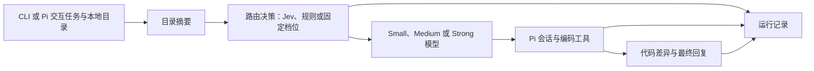

# RouterCoder 编码智能体

RouterCoder 是一个按任务选择模型的编码智能体。它使用 Jev 判断任务难度，从三档模型中选出一档，再由 Pi 在本地目录中修改代码。目标目录可以是普通文件夹，也可以是 Git 仓库。每次运行都会保存路由决策、实际模型、Token 用量、工具调用、估算费用、执行结果和代码差异。项目还提供规则路由和固定档位路由，方便本地使用及后续对照。

第一版在一项任务中始终使用同一档模型。自动判断修改质量、失败后升级模型和大规模基准评测尚未实现。

## 环境要求

- Node.js 22.19 或更新版本、npm 和 Git。仓库通过 `.nvmrc` 推荐 Node.js 24.21.0，可运行 `nvm use` 切换。
- 一个存在的目标目录。无需 `git init` 或首次提交；已有修改也可以保留。Git 命令行工具仍用于生成差异，但不会在普通目录中创建 `.git`。
- 三个不同且可在 Pi 中调用的模型及其凭据。供应商 API Key 通过环境变量提供；使用 OpenAI Codex 登录时，由 Pi 保存 OAuth 登录状态。也可以在 `~/.pi/agent/models.json` 中配置兼容接口，参见 [Pi 模型配置说明](https://pi.dev/docs/latest/models)。
- 使用 Jev 路由时需要 `JEV_API_KEY`；规则路由和固定档位路由不需要。

`models.yaml` 只保存模型信息和价格。RouterCoder 从环境变量读取 `JEV_API_KEY`，Pi 从环境变量读取供应商 API Key；Pi 的 OAuth 登录状态由 Pi 自己管理。不要把密钥写入配置文件或提交到仓库。

## 安装与配置

```bash
npm ci
cp configs/models.example.yaml configs/models.yaml
```

初步验证采用三款价格较低的 Codex 模型：Small 使用 `gpt-5.6-luna`，Medium 使用 `gpt-6-luna`，Strong 使用 `gpt-6-sol`。这是临时的难度档位，尚未证明两款 Luna 的能力顺序；GPT-6 Luna 的 API 单价实际上低于 GPT-5.6 Luna，因此不能把这组三档用于证明路由节省了费用。样例价格取自 [OpenAI API 标准价格](https://developers.openai.com/api/docs/pricing) 的 2026-09-23 快照，单位为美元 / 百万 Token。通过 Pi 的 `openai-codex` 登录 ChatGPT 时，trace 的 `estimatedCostUsd` 是 **API 等价模拟费用**，不是订阅账单；trace 中的 `costEstimateBasis` 会标注这一点。

启动任务前会检查三档模型是否都能在 Pi 中找到并具备可用凭据。使用 OpenAI Codex 时，在 Pi 终端运行 `/login` 完成 ChatGPT 登录。若改用其他供应商，请先在启动 RouterCoder 的终端加载该供应商所需的 API Key 环境变量，再编辑 `configs/models.yaml` 中三档的供应商、模型 ID、上下文长度和每百万 Token 的输入/输出价格；缓存读取/写入价格可选，省略时按普通输入价格估算。若使用兼容 OpenAI 接口的自定义服务，先在 Pi 的 `models.json` 中定义供应商和模型，再把相同的 ID 写入 `configs/models.yaml`。不要把凭据写入配置文件。

使用 Jev 时设置：

```bash
export JEV_API_KEY='你的密钥'
export JEV_MODEL='jev-latest' # 可选
```

`.env.example` 仅列出变量名称供参考，程序不会自动读取它。已写入 `~/.bashrc` 的环境变量，需要在新终端中使用，或先执行 `source ~/.bashrc`；运行中的 Pi 会话不会自动获得后续设置的变量。

## 单次运行

```bash
npm run build
node dist/cli.js run --workspace /目标目录的绝对路径 --task '修复加法测试失败' --router jev
```

也可以选择规则路由或固定档位：

```bash
node dist/cli.js run --workspace /目标目录的绝对路径 --task '修复加法测试失败' --router rule
node dist/cli.js run --workspace /目标目录的绝对路径 --task '修复加法测试失败' --router fixed --tier medium
```

省略 `--workspace` 时使用启动命令所在的当前目录。默认读取 RouterCoder 项目根目录的 `configs/models.yaml`，在任何目录启动都能找到配置；也可用 `--config` 指定其他配置。`--repo` 仍可作为 `--workspace` 的旧名称使用。`--trace-dir` 可指定运行记录目录，默认位置为项目根目录的 `traces/`；运行记录不会提交到 Git。Pi 无错误地完成任务且产生代码差异时，单次运行才算成功。CLI 会显示所选模型、选择原因、Pi 的最终回复、是否产生差异及运行记录路径；失败时返回非零退出码。

可运行 `node scripts/create-demo-repo.mjs` 创建可重复使用的示例仓库，再把脚本输出的路径传给 `--workspace`。该命令支持 Windows、macOS 和 Linux。示例仓库包含一项失败的 Node.js 测试。完成任务后可查看修改，并在目标仓库中运行 `node --test`；第一版不会自动进行质量验收。

## Pi 终端交互界面

在真实终端中启动 Pi 自带的交互界面：

```bash
node dist/cli.js interactive --workspace /目标目录的绝对路径 --router jev
```

交互模式同样支持 `--config` 和 `--trace-dir`。`--router rule` 不依赖 Jev；`--router fixed --tier small|medium|strong` 可直接指定档位。打开界面前，RouterCoder 会检查三档模型及其凭据。

每次提交新任务时，RouterCoder 会先路由，再将 Pi 切换到选定模型，并在 Pi 状态栏显示档位。本轮执行期间保持该模型；上一轮结束后提交的新任务会重新路由。若在本轮仍在执行时提交排队消息，这些消息属于当前轮，沿用当前模型。Pi 原有的聊天、文件工具和终端操作仍可使用。

任务结束时会生成独立的 JSON 运行记录，包含决策、实际模型调用、Token 用量、估算费用、工具调用、结果及本轮产生的代码差异。Pi 会通过通知显示记录路径。若 Jev 请求失败或置信度低于 0.60，则选择 `strong`，并记录原因。

交互模式会比较每轮任务前后的工作区快照，因此前几轮留下的修改不会混入下一轮的差异。如果其他进程在任务执行期间修改同一目录，这些修改可能出现在本轮记录中；交互使用时建议为目标目录留出独立工作区。快照使用系统临时目录中的 Git 对象库，不修改目标目录的 Git 索引，也不会给普通目录添加 `.git`。快照遵循工作区的 `.gitignore`，并跳过 `.git`、`node_modules`、`.venv`、`venv`、`__pycache__` 和 `.cache` 目录；这些目录中的修改不会出现在记录里。

Windows PowerShell 示例：

```powershell
cd C:\path\to\RouterCoder-Coding-Agent
$env:JEV_API_KEY = Read-Host "JEV API Key" -MaskInput
node dist/cli.js interactive --workspace "C:\path\to\your-project" --router jev
```

也可以先切换到目标目录，再省略 `--workspace`：

```powershell
cd C:\path\to\your-project
node C:\path\to\RouterCoder-Coding-Agent\dist\cli.js interactive --router jev
```

## 架构

源码按任务流程分组；各目录的职责和调用顺序见 [架构说明](docs/architecture.md)。

```text
src/
  cli.ts             命令行入口与参数解析
  app/run.ts         单次任务编排
  core/              模型配置、路由决策、费用计算和共享类型
  pi/                Pi 交互启动、扩展和单次会话适配
  repository/workspace.ts 目录检查与工作区快照
  telemetry/trace.ts 运行记录与脱敏
test/                与上述模块对应的测试
experiments/         SWE-bench 任务、实验脚本和结果
traces/              本机运行记录（JSON 文件不提交到 Git）
docs/reference/      项目原始设计文档
```

`dist/` 是 `npm run build` 生成的目录，启动入口仍为 `dist/cli.js`。`configs/models.yaml` 是本机配置，`configs/models.example.yaml` 是可提交的示例。



Jev 只回答一个与编码任务有关的 `easy / medium / hard` 难度问题，分别映射到 `small / medium / strong`。当置信度低于 0.60、响应格式无效或请求失败时，RouterCoder 会选择 `strong` 并记录原因。规则路由使用少量固定关键词；固定档位路由使用命令中指定的档位。

运行记录以仅文件所有者可访问的权限保存为 JSON，包含代码差异；如果目录是有提交的 Git 仓库，还会记录开始时的提交号，否则 `commit` 为 `null`。写入前会隐藏已知环境变量中的密钥及常见密钥格式。任务文本和代码差异仍会保存在记录中，因此不要在其中放入其他敏感信息。智能体费用根据配置中的价格快照和 Pi 报告的 Token 用量估算；如配置了缓存读取/写入价格，会分别计算。配置中没有 Jev 价格，因此估算费用不包含 Jev。

## 开发

```bash
npm run check
npm test
npm run build
```

[项目建议书](docs/reference/Adaptive_Coding_Agent_Project_Proposal.docx)和[项目补充说明书](docs/reference/自适应多模型路由Agent_项目补充说明书.docx)是设计依据。第一版实现其中的编码任务和任务级路由；结果质量判定、自动升级模型和系统化基准评测留待后续版本。

本文档及后续面向使用者的项目说明统一使用中文；命令、配置字段、API 名称和模型档位保留原文。
