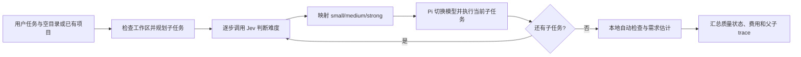

# RouterCoder 架构说明

## 目录职责

| 路径 | 职责 | 主要入口 |
| --- | --- | --- |
| `src/cli.ts` | 解析命令行参数，分发单次或交互模式 | `parseArgs`、`main` |
| `src/app/run.ts` | 编排单次任务、保存结果 | `run` |
| `src/app/planning.ts` | 用固定 Strong 模型规划有序子任务；简单任务直接执行 | `planTask` |
| `src/app/evaluation.ts` | 发现并运行本地自动检查，调用只读需求评估器，生成质量状态 | `evaluateTask` |
| `src/core/` | 校验三档模型配置、执行难度路由、计算模拟费用、定义共享类型 | `config.ts`、`decision.ts`、`pricing.ts`、`types.ts` |
| `src/pi/` | 启动 Pi、对子任务逐步切换模型、运行单次 Pi 会话 | `interactive.ts`、`extension.ts`、`runner.ts` |
| `src/repository/workspace.ts` | 检查目标目录，获取语言和文件数，计算任务前后差异 | `inspectWorkspace`、`snapshotWorkspace` |
| `src/telemetry/trace.ts` | 脱敏并写入 JSON 运行记录 | `writeTrace` |
| `test/` | 对配置、路由、仓库操作、费用和端到端行为的已有测试 | `*.test.ts` |
| `experiments/` | 基准任务输入、实验脚本、生成补丁和评估结果 | `run_verified_three.py` |
| `traces/` | 本机 JSON 运行记录；仅说明文件纳入 Git | `README.md` |
| `docs/reference/` | 项目原始设计文档 | 两份 `.docx` |

模型配置默认要求三档使用不同的 `provider/model` 组合；只有显式设置 `allowDuplicateModels: true` 才允许重复，用于验证路由与执行流程。

`scripts/create-demo-repo.mjs` 只负责创建演示仓库。`configs/models.yaml` 存放本机模型映射和价格，不存放密钥；Jev 从环境变量读取 `JEV_API_KEY`，Pi 从环境变量读取供应商 API Key。OpenAI Codex 的 OAuth 登录状态由 Pi 管理。`.env.example` 只是变量名称示例，程序不会自动加载。

## 任务流程

单次模式由 `cli.ts` 调用 `app/run.ts`。交互模式由 `pi/interactive.ts` 启动 Pi 并加载 `pi/extension.ts`；扩展拦截用户任务，规划后逐步发起子任务，在每步开始前完成路由和模型切换。两种模式都计算总任务及每步差异，允许已有修改。空目录、普通目录和没有提交的 Git 仓库也可作为目标；未指定 `--workspace` 时使用当前目录。

两种模式共用 `app/planning.ts` 的规划逻辑、`core/decision.ts` 的路由策略和 `core/config.ts` 的模型配置。短小的现有项目任务直接执行；其余任务由固定 Strong 模型规划为最多六个有序子任务。Jev 请求包含当前子任务、目录语言、文件数、工作区是否为空和部分路径；Pi 在选定模型后读取具体代码。Jev 调用失败或置信度低于 `0.60` 时，该步使用 Strong 档，原因会写入运行记录。

## 运行记录与结果含义

默认记录目录为项目根目录的 `traces/`，可通过 `--trace-dir` 改写。`plan` 保存子任务和规划成本；`subtasks` 保存每步路由、模型、工具调用和差异；`agent.metrics` 汇总规划、执行和评估用量；`quality` 保存自动检查、需求估计、置信度及证据；顶层 `diff` 保存总差异。多子任务时，顶层 `decision` 和 `selectedModel` 为 `null`，实际选择在各子任务中。

每个子任务要求 Pi 无错误完成且产生代码差异。最终还会尝试运行工作区已有的 Node.js、Python、Go 或 Rust 构建和测试命令；发现并运行的检查有失败时顶层任务失败。只读 Strong 模型用任务、验收点、最终差异和检查输出估计需求满足度。最终分数取检查通过比例与模型估计的较低值；没有可运行检查时使用模型估计并标为 `estimated`。分数低于 70 时顶层任务失败；评估不可用时仅保留本地检查结果。检查可能由执行模型自行创建，模型只读取有限差异，均不能保证所有用户需求已经满足。规划、执行与评估的模拟费用会累加；Jev 费用尚未计入。

## 修改位置

- 调整任务难度标准或路由回退：`src/core/decision.ts`。
- 修改三档模型、上下文长度和价格：`configs/models.yaml`；共享样例同步修改 `configs/models.example.yaml`。
- 修改 Pi 交互任务的模型切换与轮次记录：`src/pi/extension.ts`。
- 修改单次运行流程：`src/app/run.ts`。
- 修改子任务规划或自动检查：`src/app/planning.ts`、`src/app/evaluation.ts`。
- 修改目录摘要或差异捕获：`src/repository/workspace.ts`。
- 修改运行记录格式或脱敏：`src/telemetry/trace.ts` 和 `src/core/types.ts`。

源码编译到 `dist/`，`dist/cli.js` 是对外命令入口。`npm run build` 会先清理旧的编译文件，避免目录调整后遗留过期模块，再生成新的输出。修改源码后重新构建，再启动 RouterCoder。
